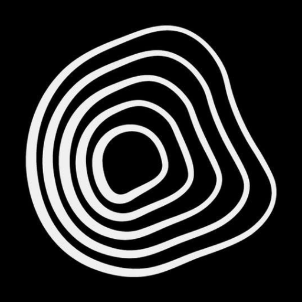

# Neurocode Studio

<p align="center">
  
</p>

**Neurocode Studio** is a high-fidelity psychoacoustic audio processing engine and desktop suite designed for synthesizing subliminal audio tracks. It encodes verbal affirmation texts directly into high-frequency stereo carriers using multi-layer Amplitude Modulation (AM), optional brainwave entrainment (Binaural Beats), surgical DSP filtering, and TPDF-dithered 320 kbps MP3 & Lossless FLAC encoding.

The entire application runs as a standalone desktop suite (using `pywebview` and `FastAPI`) or as a local web service.

---

## Key Features

- **Neural TTS Engine**: Multi-language Text-to-Speech synthesis (English, Ukrainian, Russian) with automatic per-sentence language detection.
- **Band-Limited AM Stereo Carriers**: Speech is low-pass filtered before modulation and placed on carriers from **3000 Hz** to **17500 Hz**, keeping AM sidebands below the 44.1 kHz Nyquist limit.
- **Optimized Multi-Layering (4–16 Layers, Default 8)**: Supports dense psychoacoustic stacking of up to 16 parallel voice layers (default 8) with randomized speed ($\pm 0.05\text{x}$) and frequency jitters ($\pm 150\text{ Hz}$) to eliminate phantom mono images and create a wide, diffuse subliminal field.
- **TPDF Dithered MP3 320 kbps Export**: Default export to **320 kbps Full Stereo MP3** (20 kHz cutoff) with **Triangular Probability Density Function (TPDF) Dithering**, eliminating low-level quantization distortion down to -96 dB while reducing file size by 80%.
- **Optional Lossless FLAC Export**: Bit-for-bit lossless **44.1 kHz / 16-bit / Stereo FLAC** export option for audiophile archival.
- **Mono Voice Mode (optional)**: A selectable encoding mode that renders the voice as a single carrier grid written bit-identically to both channels, at half the layer count, for playback on loudspeakers rather than headphones. Binaural beats, background music, and the stereo output format are unaffected. The default symmetrical stereo grid remains unchanged.
- **Live Word Count & File Size Prediction**: Real-time counter under affirmation text box displaying character count, word count, estimated audio duration ($\text{seconds}$), and estimated MP3 file size ($\text{MB}$).
- **Configurable Speed Range**: Asynchronous layer speech stretching randomized across user-selected range (e.g. 3.0x – 4.0x).
- **Brainwave Entrainment (Binaural Beats)**: Generates precise binaural frequencies to stimulate targeted mental states:
  - **Turbo-Manipura**: Triple Solfeggio carrier blend (126.22 Hz + 330 Hz + 528 Hz).
  - **Delta (2 Hz)**: Deep sleep, physical repair, and restoration.
  - **Theta (4 Hz)**: Deep meditation, visualization, and subconscious openness.
  - **Alpha (10 Hz)**: Flow state, active learning, and relaxed focus.
  - **Beta (15 Hz)**: Cognitive activity, alert processing, and problem-solving.
- **Surgical Notch EQ**: High-selectivity notch filter ($Q = 30$) carved exactly at the binaural carrier frequencies inside background music tracks, preventing music from acoustically masking therapeutic binaural beats.
- **Automated Audio Engineering**: Real-time automatic RMS volume normalization of background music, smooth fade-in/fade-out transitions, and peak-limiting to prevent digital clipping.
- **Controlled Processing Queue & Dynamic Port Allocation**: One DSP-heavy generation runs at a time; auto-discovers free ports (7860–7880) and polls HTTP readiness before opening the GUI window.

---

## Technical Mechanics & Psychoacoustics

```
                       ┌─────────────────────────┐
                       │   Affirmation Text      │
                       └────────────┬────────────┘
                                    ▼
                       ┌─────────────────────────┐
                       │  Multi-Language TTS    │
                       └────────────┬────────────┘
                                    ▼
                       ┌─────────────────────────┐
                       │ Asynchronous Stretching │ (2.0x - 4.0x speed)
                       └────────────┬────────────┘
                                    ▼
                       ┌─────────────────────────┐
                       │   Carrier Modulation    │ (AM Modulation: 3kHz - 18kHz)
                       └──────┬───────────┬──────┘
                              │           │
                     (Left Ch)│           │(Right Ch)
                              ▼           ▼
                      ┌───────────┐   ┌───────────┐
                      │ Left AM   │   │ Right AM  │
                      │ Carriers  │   │ Carriers  │
                      └──────┬────┘   └────┬──────┘
                             │             │
                             └──────┬──────┘
                                    ▼
                       ┌─────────────────────────┐
                       │  Binaural Beat Sync     │ (θ, α, δ, β, Turbo-Manipura)
                       └────────────┬────────────┘
                                    ▼
                       ┌─────────────────────────┐
                       │    Surgical Notch EQ    │ (Q=30 on background track)
                       └────────────┬────────────┘
                                    ▼
                       ┌─────────────────────────┐
                       │ TPDF Dither & Encoding  │ (MP3 320k / FLAC / WAV)
                       └─────────────────────────┘
```

### 1. Amplitude Modulation (AM) Subliminal Encoding
The encoder low-pass filters speech to 3.5 kHz and modulates it onto sine carriers ranging from 3 kHz to 17.5 kHz. The band limit prevents upper AM sidebands from folding across the 22.05 kHz Nyquist boundary.

### 2. Symmetrical Stereo Grid & TPDF Dithering
By default, both left and right channels contain symmetrical carrier grids from 3000 Hz to 17500 Hz. Mono mode optionally replaces this with a single grid written to both channels. Triangular Probability Density Function (TPDF) dithering is applied prior to 16-bit PCM and MP3 encoding to preserve linear signal fidelity down to -96 dB.

### 3. Surgical Notch Filtering
When enabled, background music receives narrow notch cuts at selected binaural carrier frequencies, reducing competing energy at those frequencies.

---

## Project Structure

```
SubliminalGenerator/
├── app.py                     # FastAPI backend, webview initializer, & endpoint routing
├── job_state.py               # Job registry, thread safety, cancellation, and TTS LRU cache
├── test_contracts.py          # DSP & API contract tests (44.1 kHz, volume limits, format checks)
├── run.bat                    # Launcher script with auto-dependency verification
├── requirements.txt           # Python package dependencies
├── engine/
│   ├── encoder.py             # Audio DSP: AM grid, TPDF Dither, Binaural, Notch filter, Mixdown
│   ├── tts.py                 # Multi-language Neural TTS synthesis (edge-tts)
│   └── music/                 # Directory containing background music tracks (.mp3/.wav)
└── static/
    ├── index.html             # UI structure & layout
    ├── app.js                 # UI logic, state management, live counters, and status polling
    └── style.css              # Custom styling (editorial dark theme, Liquid Flow visualizer)
```

---

## Installation & Setup

### Prerequisites
- Python 3.10 or higher.
- **FFmpeg**: Must be installed on your system and added to your system `PATH` (required for 320k Full Stereo MP3 encoding and audio decoding).

### Step 1: Clone the Repository
```bash
git clone https://github.com/Bergschloss/NeuroCode.git
cd NeuroCode/SubliminalGenerator
```

### Step 2: Launch via run.bat or Python
Simply double-click `run.bat` on Windows:
```bash
run.bat
```
`run.bat` automatically verifies all Python dependencies, installs missing packages if necessary, and opens Neurocode Studio.

Alternatively, run via command line:
```bash
python app.py
```

---

## License

This project is created for private research and development in the field of audio-psychoacoustics and subconscious stimulation.
